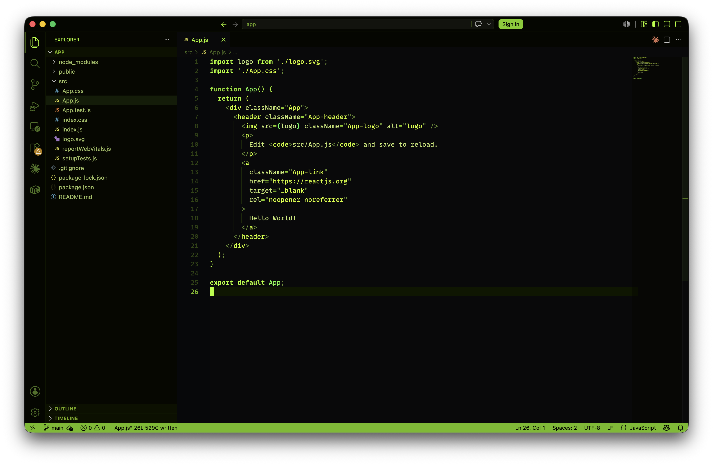

# Acid Lemonade

A dark VS Code theme featuring acid neon greens and deep black.



## Install

Clone this repo into your VS Code extensions folder:

```bash
git clone https://github.com/dongy7/acid-lemonade-vscode-theme.git ~/.vscode/extensions/acid-lemonade-vscode-theme
```

Then reload VS Code and select **Acid Lemonade** from `Preferences: Color Theme`.

## License

[MIT](LICENSE)
